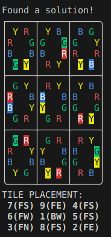

# Rubik's Tangle

## Overview

Rubik's Tangle is a Rust library that provides a solver for the 3x3 double-sided [Rubik's
tangle](https://www.jaapsch.net/puzzles/tangle.htm) puzzle.

It is essentially the same solver as the old
[Python implementation](https://github.com/plamut/rubiks-tangle), but written in Rust
for practice when learning the language.


## Usage

To use this library, add it as a dependency in your `Cargo.toml` file and then call the provided functions to generate and manipulate your tile collections:

```rust
extern crate rubiks_tangle;

fn main() {
    rubiks_tangle::solve();
}
```


## SPOILER: Solution


